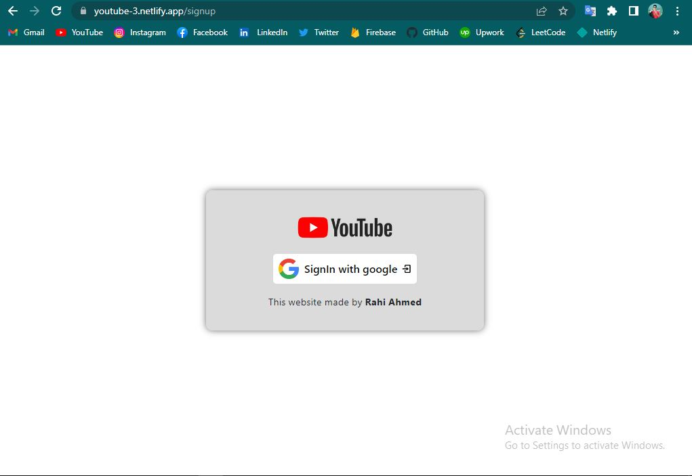
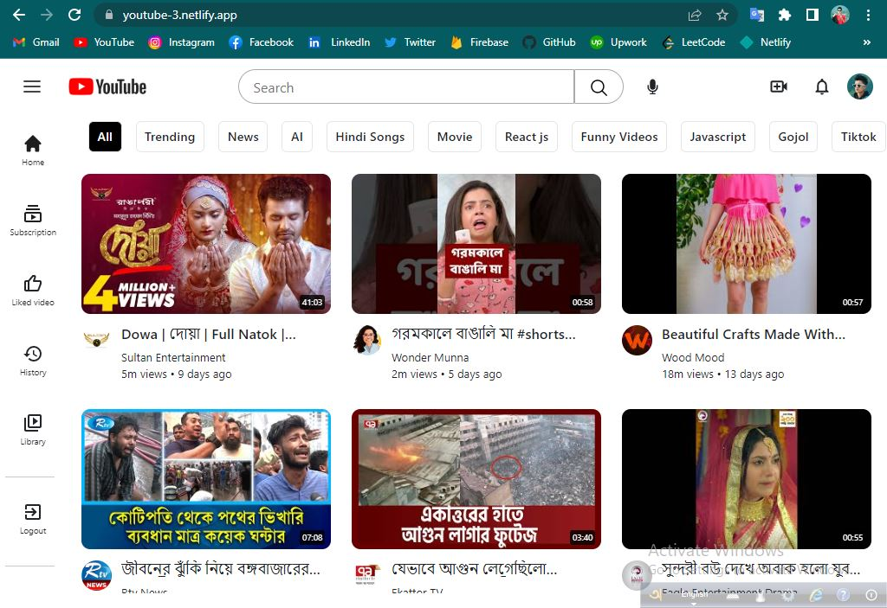
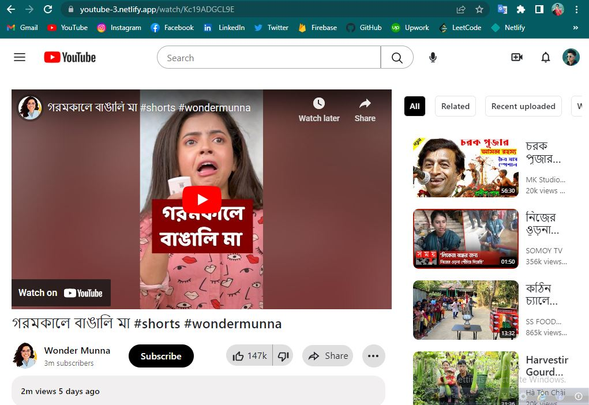
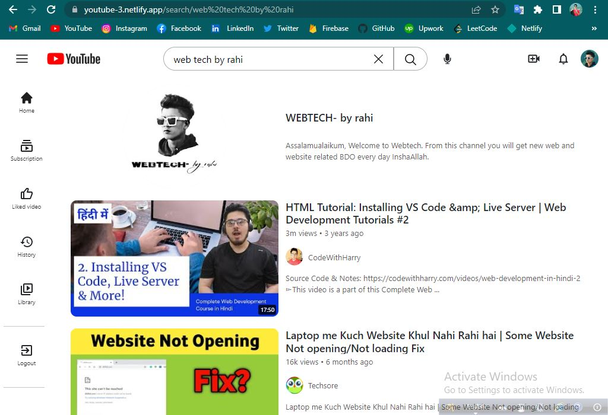
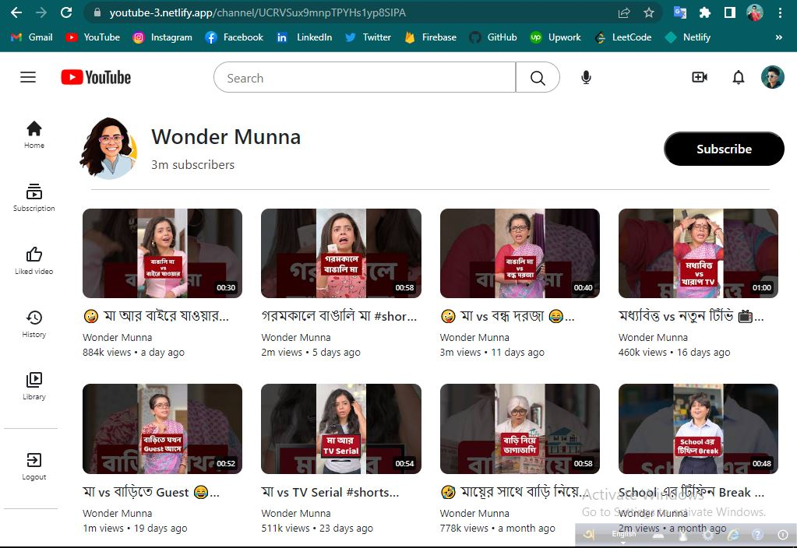
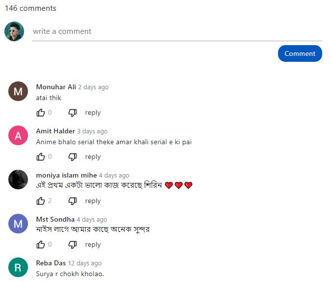
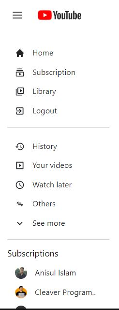

# Watch full website review in youtube
https://youtu.be/u_1htOlkSQg

# SignIn Page

### This is the sign in page. If you are not an authorized person, you may not access this website. So the first step is to sign in this website with your Gmail account. After signing in you will see the home page of this website. Otherwise you will not be able to access the home page and other pages.

 

# Home Page

### This is youtube home page. In this page are you scroll down you see load new new videos and this is infinite scroll. And you also see videos by category. When you click the category bar it's load the your selected key related videos for you. And those videos also paginated.

 

# Watch Video Page

### This is the watch page. On this page you can watch your selected video and some other videos related to your selected video in a sidebar And by clicking on any video in this sidebar, you can watch that video. And they have 'subscription status, description, like, dislike, share and menu icons'. You can share this video on your social network by clicking the share button. And if you click on the menu icon, you will see some menu options.

 

# Search Page

### This is Search page. In this page you will search anything and get the result to your search. And it will be also Channel and Videos. And you can watch your video from here just click this video whatever you want and watch. And if you click the channel icon you will redirect to channel page and here you see this channel some videos.

 

# Channel Page

### This is Channel page. In this page you not see the channel cover photo, because youtube api don't share to me the channel cover photo. But you can see the channel name, subscriber count, channel icon, and some videos from this channel.

 

# Comment Section

### This is Comment section. You can comment those video and this comment will be added in this video comments section and it real.

 

# Menu bar

### This is Menu bar. And it's like youtube menu bar. Here is lot of options.

 
 

## Website Link

https://youtube-3.netlify.app
